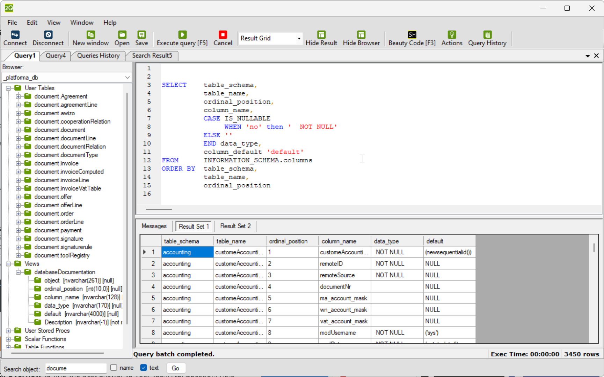
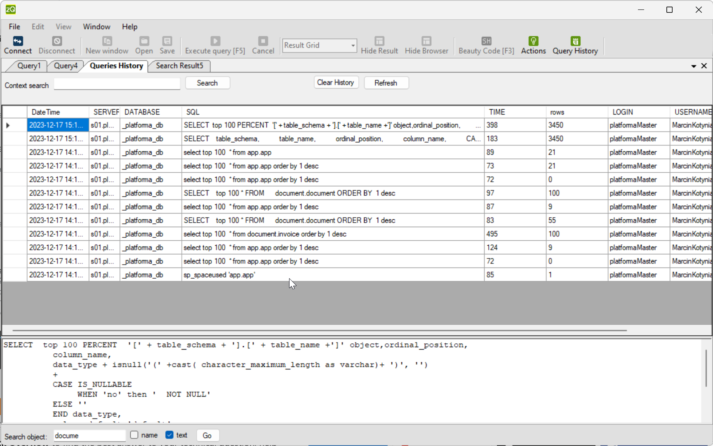
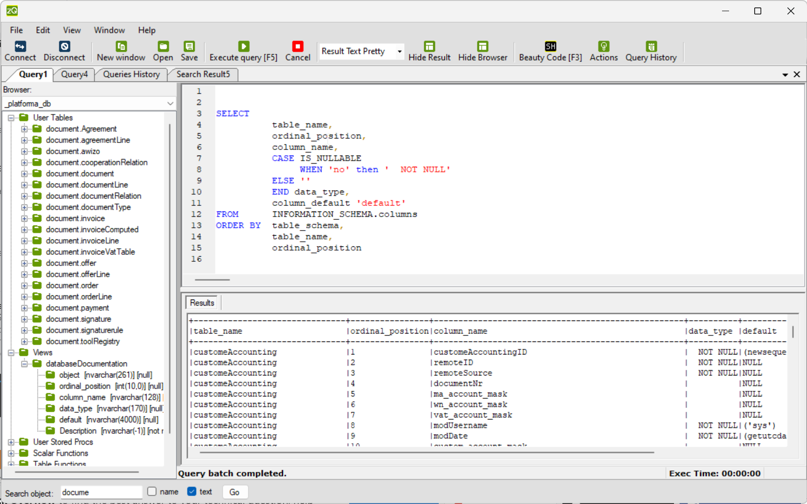

# ZenQuery - no installation Database Tool for SQL Server and SQLite, Oracle

## Key Features

- **No Installation Required:** ultra-light and fast tool, perfect for remote server usage.
- **Built-in SQL Formatter**
- **Query History:** Keep track of your executed queries and navigate through your history for efficient workflow.
- **Flexible Result Presentation:** View results in grid or text format, and leverage 'pretty text' and transpose 'row to column' options.
- **Search in Objects Definitions:** Effortlessly search through object definitions and by object name for enhanced productivity.
- **Script Generation:** Create update, delete, select, and insert scripts directly from the result window. Select rows or cells to generate  scripts.

## System Requirements

- **Operating System:** Microsoft Windows
- **Framework:** .NET Framework 4.8

## ChangeLog

- **2005:** Initial version
- **2006:** Added SQLite support, search in objects definitions, and search by object name
- **2023:** Cleanup and upgrade to .NET 4.8, Release

## History

zenQuery was originally developed in 2005 as a lightweight tool for SQL Server. In 2006 it was rewritten based on Joseph Albahari Query Express. The tool was used internally for many years and was never released to the public. In 2015 the tool was published on GitHub. In 2023 the tool was cleaned up and upgraded to .NET 4.8. and Release version was published. 

## Screenshots

### Query History

### Result Text Pretty

